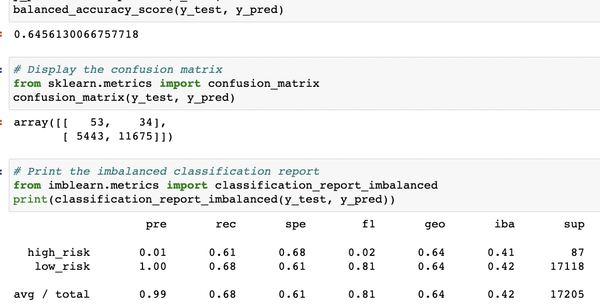
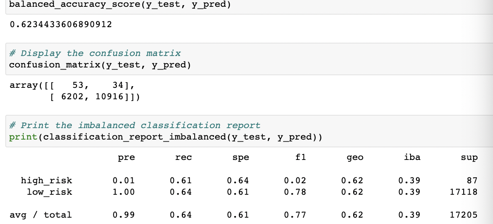
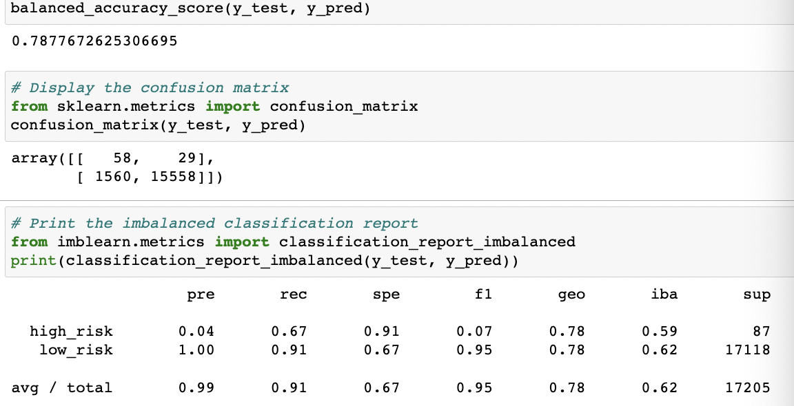
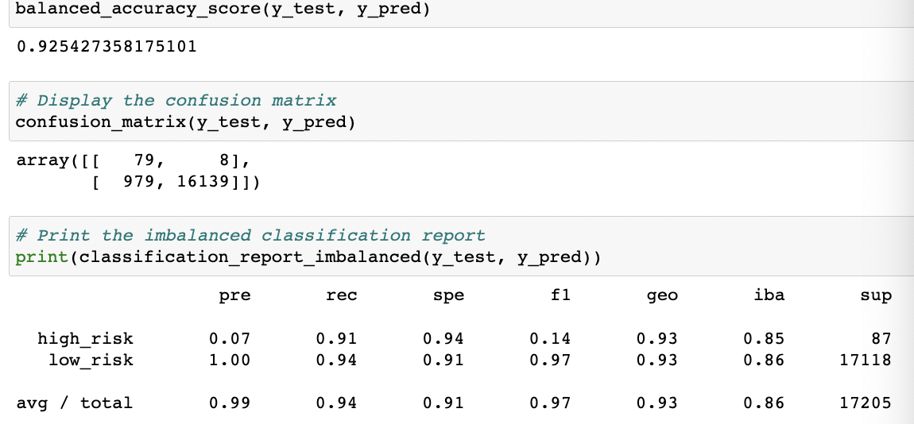

# Credit Risk Analysis

## Overview of the Analysis
Using the credit card credit dataset from LendingClub, a peer-to-peer lending services company, the purpose of the analysis is to oversample the data using the RandomOverSampler and SMOTE algorithms, and undersample the data using the ClusterCentroids algorithm. Then, to use a combinatorial approach of over- and undersampling using the SMOTEENN algorithm. Next, two new machine learning models that reduce bias,BalancedRandomForestClassifier and EasyEnsembleClassifier, will be compared to predict credit risk. Finally, the performance of these models will be evaluate and a recommendation will be made on whether they should be used to predict credit risk.

## Analysis Process

### Used Resampling Models to Predict Credit Risk
Used the `imbalanced-learn` and `scikit-learn` libraries, to evaluate three machine learning models by using resampling to determine which is better at predicting credit risk. First, used the oversampling `RandomOverSampler` and `SMOTE` algorithms, and then used the undersampling `ClusterCentroids` algorithm. Used these algorithms, to resample the dataset, view the count of the target classes, train a logistic regression classifier, calculate the balanced accuracy score, generate a confusion matrix, and generate a classification report.

For more information on how this was done please see the [credit_risk_resampling](credit_risk_resampling.ipynb) file.

### Used the SMOTEENN algorithm to Predict Credit Risk
Used the `imbalanced-learn` and `scikit-learn` libraries, to use a combinatorial approach of over- and undersampling with the `SMOTEENN` algorithm to determine if the results from the combinatorial approach are better at predicting credit risk than the resampling algorithms from Deliverable 1. Used the `SMOTEENN` algorithm, resampled the dataset, viewed the count of the target classes, trained a logistic regression classifier, calculated the balanced accuracy score, generated a confusion matrix, and generated a classification report.

For more information on how this was done please see the [credit_risk_resampling](credit_risk_resampling.ipynb) file.

### Used Ensemble Classifiers to Predict Credit Risk
Used the `imblearn.ensemble` library, to train and compare two different ensemble classifiers, `BalancedRandomForestClassifier` and `EasyEnsembleClassifier`, to predict credit risk and evaluate each model. Used both algorithms, to resample the dataset, view the count of the target classes, train the ensemble classifier, calculate the balanced accuracy score, generate a confusion matrix, and generate a classification report.

For more information on how this was done please see the [credit_risk_ensemble](credit_risk_ensemble.ipynb) file.

## Results 

### Naive Random OverSampling
The `RandomOverSampler` algorithim provided the following results:

#### Balanced Accuracy Score
* **Balanced Accuracy Score:** 0.65 (65% accuracy)

#### Precision
* **low_risk**: 1.00 (of all loan status' identified as low_risk, 100% were truly low risk)

* **high_risk**: 0.01 (of all loan status' identified as high_risk, only 1% were actually high risk)

#### Recall 
* **low_risk**: 0.68 (of all the true low-risk loan status', only 68% were predicted as low-risk)
* **high_risk**: 0.61 (of all the true high-risk loan status', only 61% were predicted as high-risk)

Please see below for full results:

### SMOTE Oversampling
The `SMOTE` algorithim provided the following results:

#### Balanced Accuracy Score
* **Balanced Accuracy Score:** 0.62 (62% accuracy)

#### Precision
* **low_risk**: 1.00 (of all loan status' identified as low_risk, 100% were truly low risk)

* **high_risk**: 0.01 (of all loan status' identified as high_risk, only 1% were actually high risk)

#### Recall 
* **low_risk**: 0.64 (of all the true low-risk loan status', only 64% were predicted as low-risk)
* **high_risk**: 0.61 (of all the true high-risk loan status', only 61% were predicted as high-risk)

Please see below for full results:

### Undersampling
The `ClusterCentroids` algorithim provided the following results:

#### Balanced Accuracy Score
* **Balanced Accuracy Score:** 0.52 (52% accuracy)

#### Precision
* **low_risk**: 1.00 (of all loan status' identified as low_risk, 100% were truly low risk)

* **high_risk**: 0.01 (of all loan status' identified as high_risk, only 1% were actually high risk)

#### Recall 
* **low_risk**: 0.46 (of all the true low-risk loan status', only 46% were predicted as low-risk)
* **high_risk**: 0.59 (of all the true high-risk loan status', only 59% were predicted as high-risk)

Please see below for full results:

### Combination (Over and Under) Sampling
The `SMOTEENN` algorithim provided the following results:

#### Balanced Accuracy Score
* **Balanced Accuracy Score:** 0.65 (65% accuracy)

#### Precision
* **low_risk**: 1.00 (of all loan status' identified as low_risk, 100% were truly low risk)

* **high_risk**: 0.01 (of all loan status' identified as high_risk, only 1% were actually high risk)

#### Recall 
* **low_risk**: 0.62 (of all the true low-risk loan status', only 62% were predicted as low-risk)

* **high_risk**: 0.69 (of all the true high-risk loan status', only 69% were predicted as high-risk)

Please see below for full results:

### Balanced Random Forest Classifer
The `BalancedRandomForestClassifier` algorithim provided the following results:

#### Balanced Accuracy Score
* **Balanced Accuracy Score:** 0.78 (78% accuracy)

#### Precision
* **low_risk**: 1.00 (of all loan status' identified as low_risk, 100% were truly low risk)

* **high_risk**: 0.04 (of all loan status' identified as high_risk, only 4% were actually high risk)

#### Recall 
* **low_risk**: 0.91 (of all the true low-risk loan status', only 91% were predicted as low-risk)
* **high_risk**: 0.67 (of all the true high-risk loan status', only 67% were predicted as high-risk)

Please see below for full results:

### Easy Ensemble AdaBoost Classifer
The `EasyEnsembleClassifer` algorithim provided the following results:

#### Balanced Accuracy Score
* **Balanced Accuracy Score:** 0.93 (93% accuracy)

#### Precision
* **low_risk**: 1.00 (of all loan status' identified as low_risk, 100% were truly low risk)

* **high_risk**: 0.07 (of all loan status' identified as high_risk, only 7% were actually high risk)

#### Recall 
* **low_risk**: 0.91 (of all the true low-risk loan status', only 91% were predicted as low-risk)
* **high_risk**: 0.94 (of all the true high-risk loan status', only 94% were predicted as high-risk)

Please see below for full results:

## Summary and Recommendations

### Naive Random OverSampling Summary 
The model had a low balanced accuracy score of 64.6%. While the model had very good precision for low-risk loan status' (100%), it had very poor precision for high-risk (only 1%). In terms of sensitivity, both low-risk and high-risk scored fairly low (68% and 61% respectively). Overall the model's performance was not ideal for predicting a high-risk loan status. 

### SMOTE Oversampling Summary 
The model had a low balanced accuracy score of 62.3%(lower than Naive Random Oversampling). While the model had very good precision for low-risk loan status' (100%), it had very poor precision for high-risk (only 1%). In terms of sensitivity, both low-risk and high-risk scored fairly low (64% and 61% respectively). Overall the model's performance was not ideal for predicting a high-risk loan status. 

### Undersampling Oversampling Summary 
The model had the lowest balanced accuracy score of 52.2%. While the model had very good precision for low-risk loan status' (100%), it had very poor precision for high-risk (only 1%). In terms of sensitivity, both low-risk and high-risk had the lowest scores of all the models(46% and 59% respectively). Overall the model performed the worst out of all models tested. 

### Combination (Over and Under) Sampling Summary 
The model had a low balanced accuracy score of 65.3%(higher than Naive Random Oversampling). While the model had very good precision for low-risk loan status' (100%), it had very poor precision for high-risk (only 1%). In terms of sensitivity, both low-risk and high-risk scored fairly low (62% and 69% respectively). While the model had slightly higher sensitivy score for high-risk, overall the model's performance was not ideal for predicting a high-risk loan status. 

### Balanced Random Forest Classifer
The model had a decent balanced accuracy score of 78.8%(higher than all models above). While the model had very good precision for low-risk loan status' (100%), it had poor precision for high-risk (4%, although this is better than the models above). In terms of sensitivity, the model scored well for low-risk (91%) but fairly low for high-risk (67%). While the model had a high accuracy score and a higher sensitivy score for high-risk, the model's performance may not be the best to predict a high-risk loan status. 

### Easy Ensemble AdaBoost Classifer
The model had a fairly impressive balanced accuracy of 92.5% (highest of all models). While the model had very good precision for low-risk loan status' (100%), it had poor precision for high-risk (7%, although this is the best of all models). In terms of sensitivity, the model scored well for both low-risk (94%) and high-risk (91%). While a higher precision for high-risk status would be preferred, the model would be a decent for predicting a high-risk loan status.

### Recommendation 
To predict credit risk, while precision and sensitivity are both important, more emphasis should be on sensitivity so that of those who are actually high-risk, most of them will be predicted as high-risk. Based on the results of the models, it is clear that the Easy Ensemble AdaBoost Classifer model would be the best choice to predict credit risk. The model had the highest accuracy and very good sensitivity scores for both high-risk and low-risk. One thing to note is that the model had a low precision score for high-risk (which means that of all the loan status' identified as high-risk, only 1% were actually high risk while the remaining were actually low-risk). This would not be good for those who are low-risk but predicted high-risk as they may not be granted a loan. However, from the perspective of the loaner, it is prehaps better to be prudent and have more false positives than false negatives to avoid default. 
